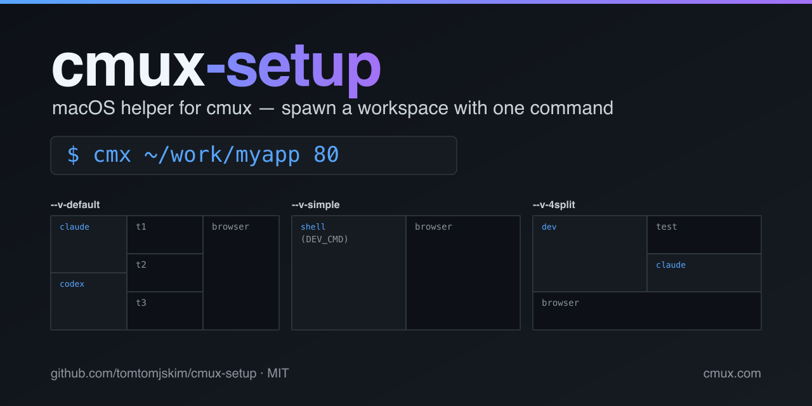

# cmux-setup

<p align="center">
  
</p>

[](https://github.com/tomtomjskim/cmux-setup/actions/workflows/smoke.yml)
[](https://www.apple.com/macos)
[](LICENSE)

[cmux](https://cmux.com) 워크스페이스 + 패널 레이아웃을 한 명령으로 자동 세팅하는 macOS 도구 모음.

```bash
cmx ~/work/myapp 80
```

→ cmux 가 새 워크스페이스를 띄우고, 3단 패널(claude/codex | 터미널 3개 | 브라우저) 을 자동 구성합니다.

> **English**: A macOS helper that wraps the [cmux](https://cmux.com) GUI app. Type `cmx <project-path>` to spawn a cmux workspace with one of three preset panel layouts (3-column / simple / 4-split). Read [docs/usage.md](docs/usage.md) for details.

## 레이아웃 미리보기

```text
default (3단)                                    simple                     4split
┌──────────┬──────────┬──────────┐                ┌──────────┬──────────┐    ┌──────────┬──────────┐
│ claude   │   t1     │          │                │  shell   │ browser  │    │          │  test    │
├──────────┤   t2     │ browser  │                │ (DEV_CMD)│          │    │   dev    ├──────────┤
│ codex    │   t3     │          │                └──────────┴──────────┘    │          │  claude  │
└──────────┴──────────┴──────────┘                                           ├──────────┴──────────┤
                                                                             │       browser       │
                                                                             └─────────────────────┘
```

## 빠른 시작

```bash
# 0) cmux.app 설치 (미설치 시)
brew install --cask manaflow/cmux/cmux       # 또는 https://cmux.com 에서 DMG
open -a cmux                                  # 한 번 실행해 /usr/local/bin/cmux 등록

# 1) 리포 클론 (경로는 자유)
REPO_DIR="$HOME/dev/cmux-setup"
git clone https://github.com/tomtomjskim/cmux-setup.git "$REPO_DIR"

# 2) 부트스트랩 — 의존성 점검 + ~/.zshrc 에 cmux-setup 블록 추가 (idempotent)
"$REPO_DIR/install.sh"

# 3) 새 셸 열기 (또는 source ~/.zshrc)

# 4) 사용
cmx ~/work/myapp 80
```

> **uninstall**: `"$REPO_DIR/install.sh" uninstall` 로 ~/.zshrc 통합 제거 (백업 자동 생성).

## 무엇이 들어 있나

| 파일 | 역할 |
|---|---|
| `bin/cmux-setup.sh` | 메인. 디렉토리 + 포트(또는 URL) 받아 cmux 워크스페이스 자동 구성 |
| `bin/set-cursor-default.sh` | 코드 파일을 Xcode 대신 Cursor 로 열도록 macOS LaunchServices 갱신 |
| `bin/check-default-apps.sh` | 기본 앱 매핑 진단 + 브라우저 원복 |
| `shell/aliases.zsh` | 글로벌 `cmx` alias + 보조 alias (커밋됨) |
| `shell/aliases.local.zsh.example` | 머신/회사별 단축 alias 템플릿 (실제 파일은 gitignore) |
| `templates/cmux.conf.example` | 프로젝트별 영구 설정 템플릿 |
| `install.sh` | 부트스트랩 (idempotent) + `uninstall` 모드 |
| `tests/smoke.sh` | 단위 + mock cmux 통합 테스트 |

## 사용법 한눈에

```bash
cmx                          # 현재 디렉토리, 기본 3단 레이아웃, port 80
cmx ~/work/myapp 8081        # 두 번째 인자가 숫자 → http://localhost:8081
cmx ~/work/myapp http://app.local        # URL 인자
cmx ~/work/myapp 80 --v-simple           # 터미널 | 브라우저 단순 레이아웃
cmx ~/work/myapp 80 --v-4split           # dev/test/claude/브라우저 4분할
CMX_DEBUG=1 cmx ~/work/myapp             # 디버그 모드
```

자세한 내용은 [docs/usage.md](docs/usage.md).

## 레이아웃

3종 프리셋. [docs/layouts.md](docs/layouts.md) 에 다이어그램·코드 흐름 정리.

- `--v-default` (기본): 왼쪽 `claude`/`codex` | 중간 `t1`/`t2`/`t3` | 오른쪽 브라우저
- `--v-simple`: 터미널 | 브라우저
- `--v-4split`: dev / test / claude / 브라우저 4분할

## 프로젝트별 영구 설정 — `.cmux.conf`

프로젝트 디렉토리에 `.cmux.conf` 파일을 두면 자동 로드. **`source` 가 아니라 화이트리스트 KEY=VALUE 파서**로 읽으므로 임의 코드 실행 위험 없음. 허용 키: `PORT`, `BROWSER_URL`, `DEV_CMD`, `TEST_CMD`, `CLAUDE_CMD`, `CODEX_CMD`, `LAYOUT`. 자세한 예시는 [templates/cmux.conf.example](templates/cmux.conf.example).

```bash
# <project>/.cmux.conf
PORT=8080
BROWSER_URL=http://app.local
DEV_CMD="npm run dev"
TEST_CMD="phpunit --watch"
CLAUDE_CMD="claude"
CODEX_CMD="codex"
LAYOUT="simple"
```

우선순위: **명령행 인자 > `.cmux.conf` > 스크립트 기본값**.

## 단축 alias

`shell/aliases.zsh` 에 `cmx` 글로벌 alias 가 있고, 자주 쓰는 프로젝트는 `aliases.local.zsh` 에 두면 됩니다 (gitignore 되어 외부 노출 없음).

```bash
cp "$CMUX_SETUP_DIR/shell/aliases.local.zsh.example" \
   "$CMUX_SETUP_DIR/shell/aliases.local.zsh"
# 주석 풀고 본인 프로젝트 경로/포트로 수정
```

## macOS 단축키 충돌

cmux 의 `⌃ 1-9` (surface 점프) 가 macOS Mission Control 과 충돌합니다. 해결책은 [docs/shortcuts.md](docs/shortcuts.md).

## 코드 파일이 Xcode 로 열릴 때

[docs/default-apps.md](docs/default-apps.md) — `set-cursor-default.sh` 사용법, 부작용, 원복.

## 트러블슈팅

[docs/troubleshooting.md](docs/troubleshooting.md) — `ref 추출 실패`, `Workspace index not found`, 비율, 디버그 모드 등.

## 다른 PC 에서도 똑같이 — AI 에이전트 프롬프트

[docs/setup-prompt.md](docs/setup-prompt.md) 에 Claude Code / Cursor 에 그대로 복사해서 줄 수 있는 프롬프트를 박아두었습니다.

## PM 운영 패턴 참조

다중 세션 (코드 작업 + PM 세션) 운영 시 [docs/pm-operation-guide.md](docs/pm-operation-guide.md) 참조. 실 다중 트랙 closure 경험 정리.

## 의존성

- macOS (Apple Silicon / Intel 모두 OK)
- [cmux.app](https://cmux.com) — Spotlight 에서 한 번 실행되어 있어야 함
- (선택) `duti` — `set-cursor-default.sh` 만 사용. 첫 실행 시 동의 후 `brew install duti`

## 기여

[CONTRIBUTING.md](CONTRIBUTING.md) 참고. PR 보내기 전 `tests/smoke.sh` 통과 필수.

## 라이선스

[MIT](LICENSE)
